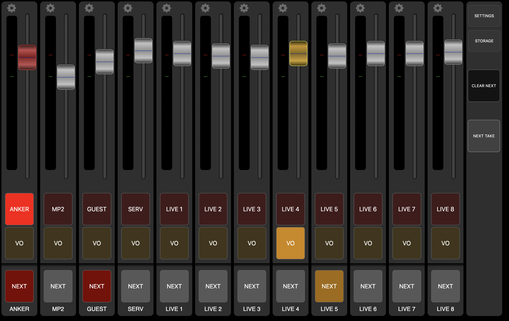
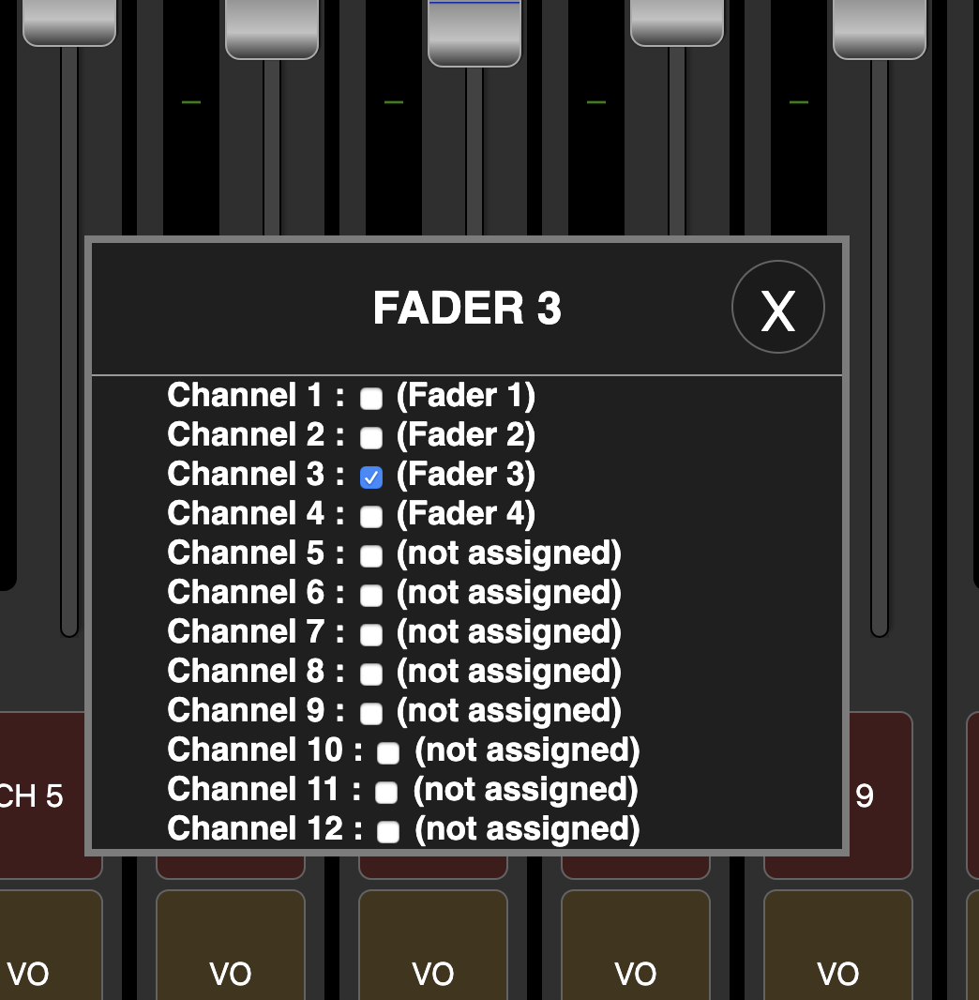
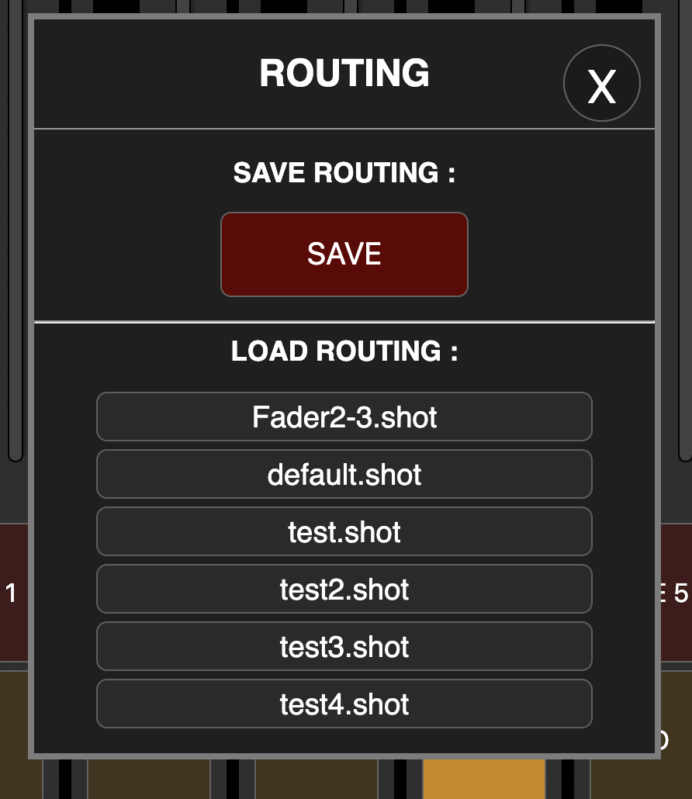

# Sisyfos Audio Controller

## Audiomixer control build for intelligent automation.

You use the fader for the level, and PGM on/off for fade-in/out.
TAKE NEXT crossfades from NEXT to PGM

It´s fast to see what faders are on-are, and whther they are PGM level or Voice over level


### Routing of Faders to Channels
Routing of Faders to multiple channels or a single channel are possible. This way Sisyfos can control some or all channels on a mixer. And a single fader can be used for E.G. a 5.1 (on 6 mono faders)



### Load/Save Routing
Routing setups can be stored in STORAGE. So it´s possible to have different Routings dependent of what setup the Audio mixer is using.




### When Automation mode is Disabled in settings - snaps takes preset into PST/NEXT:


### Run as Docker: (On linux)
```
docker pull olzzon/sisyfos-audio-controller:develop
docker volume create sisyfos-vol
sudo docker run --mount source=sisyfos-vol,target=/opt/sisyfos-audio-controller/storage -e loggerIp='0.0.0.0' -e loggerPort=9300 -e loggerFileLevel='error' --network="host" --restart always olzzon/sisyfos-audio-controller:develop
```
Running Docker with Elastic Search: 
Set env vars: loggerIp=xx.xx.xx.xx and loggerPort=xxxx and loggerLevel='info' 

if you wish to log to logfile instead of kibana:
Set env var: -e loggerFileLevel='info'
(no kibana args will default to: 0.0.0.0:9200 logger level='info')

### Install Local node host:
(Be aware that a server reload will quit server and you need an external source to restart)
```
git clone https://github.com/olzzon/sisyfos-audio-controller.git
cd sisyfos-audio-controller
yarn
yarn build
yarn start --loggerConsoleLevel='info'
```
Running Server with Elastic Search: 
(no args will default to: 0.0.0.0:9200)
```
yarn start --loggerIp '192.168.12.12' --loggerPort 9302
```

### Logger levels:
When running Sisyfos you can define the log level by:
loggerLevel (Kibana log level) and loggerFileLevel (local log file level) and loggerConsoleLevel (local log to console)
The levels are:
* error (only error)
* info (standard info regarding connectiviy and data from Automation protocol etc.)
* verbose (info level plus: data send and received from Audiomixer)

### Open GUI in browser:
```
localhost:1176 (or whatever ip you use for Sisyfos Nodejs/Docker)
IF you wan´t to disable settings:
localhost:1176/?settings=0
``` 

## Settings:
### Show PFL Controls:
As NEXT has been implemented, and PFL usually only work on on channel at a time, the PFL is only working correctly on 1:1 routed setups (And with the CasparCG protocol)


(Mixer presets are stored in MixerProtocolPresets.js)
### Following preset name are possible:
* CasparCG
  * copy sisyfos-casparcg-geometry.json from Docs/CasparCG-Example to the root of your user account
  * base your casparcg.config by the casparcg.config file in the same folder
  * remember to active OSC in the casparcg.config file

* reaper
  * OSC protocol for control Reaper (reaper.fm)
* Ardour Master
  * OSC protocol for Ardour (www.ardour.org)
  * Port 3819
  * The volume change in Ardour is on it´s channel faders.
  * Todo:
    * Group support
    * Meter calibration
* SSL System T - Broadcast Mixer
  * SSL Automation Protocol for System T
  * Port 10001
  * Set Protocol Latency to around 100ms
* Midas Master
  * OSC protocol for Midas M32 and Behringer X32
  * Port 10023
  * The volume change on the Midas/X32 desk is on it´s channel faders.
* Midas Client
  * OSC protocol for Midas M32 and Behringer X32
  * Port 10023
  * Route ch 1-16 to bus 1-2 and in main turn off main stereo
  * Set send to Bus 1-2 to Post Fader on all channels
  * Link Bus 1-2 to stereo and in main turn on main stereo
  * Send to Bus 1-2 is then used for Fade In-Out
  * Be aware of post faders mix% issues.
* Behringer xr client
  * OSC protocol for Behringer XR12-16-18
  * Port 10024
  * Route ch 1-16 to bus 1-2 and in main turn off main stereo
  * Set send to Bus 1-2 to Post Fader on all channels
  * Link Bus 1-2 to stereo and in main turn on main stereo
  * Send to Bus 1-2 is then used for Fade In-Out
* Behringer xr master
  * OSC protocol for Behringer XR12,16,18
  * Port 10024
  * In this version the Behringer is slave of Producers-Audio-mixer, so faders on the behringer is turned down when channel is of.
* DMXIS - Sisyfos control of DMX Lightcontroller
  * Default Port is 8000
  * Controls Fader On/Off with preset level from Sisyfos.
  * Easy implementation of state based lightcontrol from Automation.
  * the PROTOCOL DELAY setting should be raised to 50ms, as DMXIS is responding a little slowly.
* midi
  * Generic MIDI - still preminilary
  * When using MIDI protocols, the PROTOCOL DELAY setting should be rised to at least 50ms
* Yamaha QL1
  * MIDI based Protocol
  * For now only the 24 first channels are supported.
  * Set label not supported
  * When using MIDI protocols, the PROTOCOL DELAY setting should be rised to at least 50ms


## Automation Support:
It´s possible to control the Producers-Audio-Mixer from an automationsystem, for it to act as middleware.

## Set state:
To set the state send these OSC commands from you Automation to ProducersAudioMixer Port: 5255:
#### Set channel to PGM (optional: indiviaul fadetime): 
(the integer defines: 0 - Off, 1 - Pgm On, 2 - Voice Over)
(if second is missing it will take default fade value)
/ch/1/mix/pgm - integer: { 0, 1 or 2 } - float { fadetime in ms }
#### Set channel to PST:
/ch/1/mix/pst - integer: { 0, 1 or 2 } (the integer defines: 0 - Off, 1 - Pgm On, 2 - Voice Over)
#### Mute channel:
/ch/1/mute - integer: { 0, 1 } (the integer defines: 0 - Mute off, 1 - Mute On)
#### Set channel faderlevel:
/ch/1/mix/faderlevel - float {between 0 and 1}
#### Set channel label:
/ch/1/label - string {name of channel}
#### Inject Command:
Pass a command directly from Automation to Audiomixer
/inject
#### Crossfade between PGM and PST:
/take
#### Set snap 1-xx to PST:
/snap/1
#### Fade all channels to black (mute)
/fadetoblack
#### Clear all pst buttons
/clearpst
#### Hide or show channel strips on GUI: 
/ch/{value1}/visible - integer { 0 or 1 }

## Get state:
#### Get full state of all channels:
/state/full -  returns a json string with an array of channels: { pgmOn: boolean, pstOn: boolean, faderLevel: boolean }
#### Get state channel PGM:
/state/ch/1/mix/pgm - returns pgm state integer { 0 or 1 }
#### get state channel PST:
/state/ch/1/mix/pst - returns pgm state integer { 0 or 1 }
#### Get state channel faderlevel:
/state/ch/1/mix/faderlevel - float {between 0 and 1}
#### get state channel Mute:
/state/ch/1/mute - returns mute state integer { 0 or 1 }
#### Get state group PGM:
/state/ch/1/mix/pgm - returns pgm state integer { 0 or 1 }
#### get state group PST:
/state/ch/1/mix/pst - returns pgm state integer { 0 or 1 }
#### Get state group faderlevel:
/state/ch/1/mix/faderlevel - float {between 0 and 1}

## Check connectivity
/ping/{value}
_In response to a ping, sisyfos will reply with /pong and the provided value OR 'offline' if Audiomixer is not connected_
