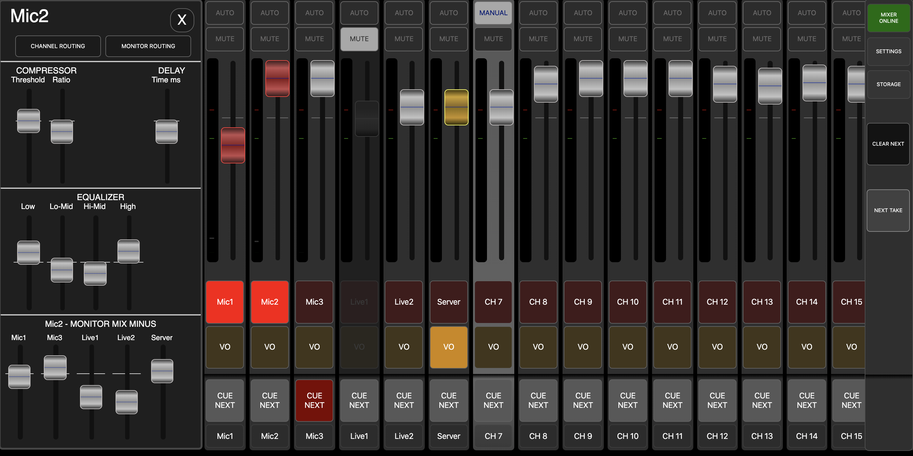
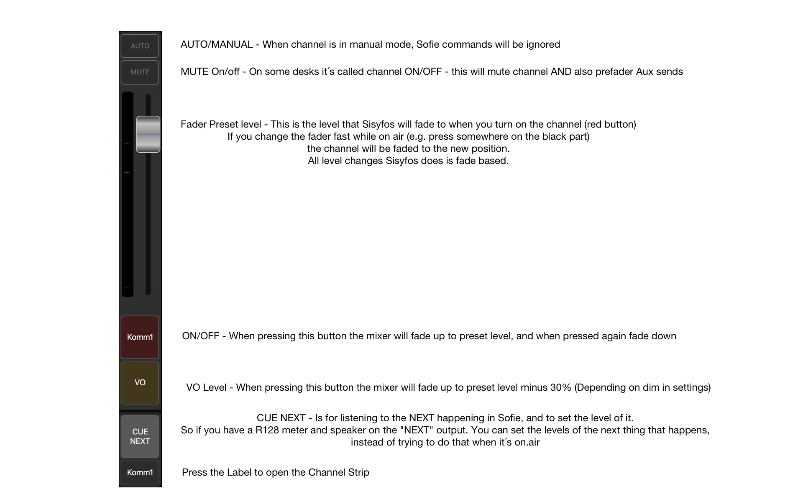
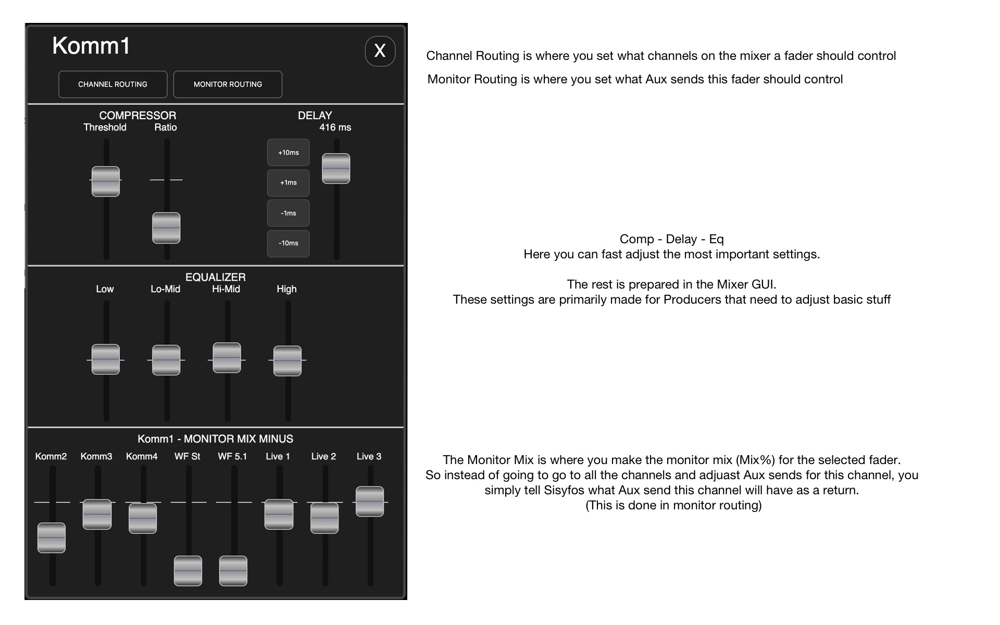
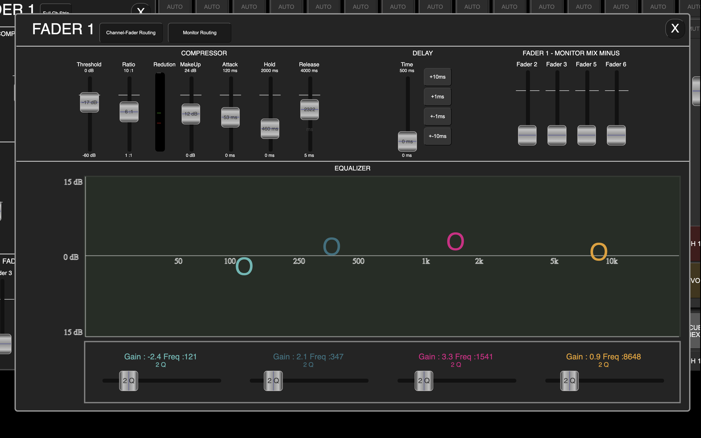
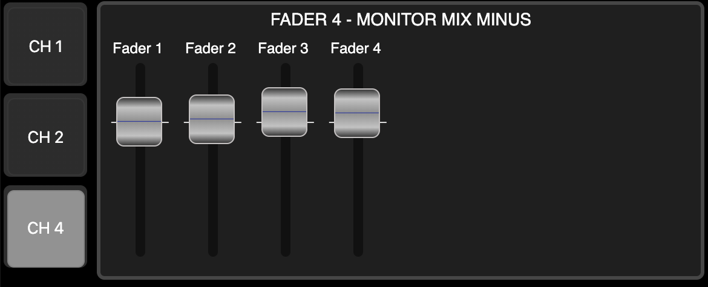
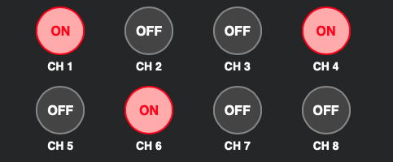

# Sisyfos Audio Controller

[](https://github.com/tv2/sisyfos-audio-controller/actions/workflows/deploy-image.yml)

## Audiomixer control build for intelligent automation.

You use the fader for the level, and PGM on/off for fade-in/out.
TAKE NEXT crossfades from NEXT to PGM

It´s fast to see what faders are on-aie, and whether they are PGM level or Voiceover level

### GUI with open channelstrip:



### These are the functions on each channel:



### These are the functions on the channelstrip:

(You open the channelstrip by clicking on the channel label)
The features on the channelstrip depends on the Mixer Protocol.



### Full Channelstrip:

(You open the channelstrip by clicking on the "Full Ch.Strip" in the normal channelstrip)

The Advanced channelstrip has all the features the seleced Mixer Protol supports. (Example: Midas M32)



### If you need a MiniMonitorView for a client:

Run webpage with

```
localhost/?view=minimonitor
```



### If you need a Microphone Tally View for a client:

Run webpage with

```
localhost/?view=mic-tally
```



### Routing of Faders to Channels

Routing of Faders to multiple channels or a single channel are possible. This way Sisyfos can control some or all channels on a mixer. And a single fader can be used for E.G. a 5.1 (on 6 mono faders)

### Load/Save Routing

Routing setups can be stored in STORAGE. So it´s possible to have different Routings dependent of what setup the Audio mixer is using.

### Run as Docker: (On linux)

```
docker pull tv2media/sisyfos-audio-controller:develop
docker volume create sisyfos-vol
sudo docker run --mount source=sisyfos-vol,target=/opt/sisyfos-audio-controller/storage --network="host" --restart always tv2media/sisyfos-audio-controller:develop
```

### Run as Docker: (On windows)

```
docker pull tv2media/sisyfos-audio-controller:develop
docker volume create sisyfos-vol
docker run --mount source=sisyfos-vol,target=/opt/sisyfos-audio-controller/storage -p 1176:1176 -p 5255:5255 --restart always tv2media/sisyfos-audio-controller:develop
```

### Install Local node host:

(Be aware that a server reload will quit server and you need an external source to restart)

```
git clone https://github.com/tv2media/sisyfos-audio-controller.git
cd sisyfos-audio-controller
yarn
yarn build
yarn start
```

### Log levels:

When running Sisyfos you can define the log level by setting the environment variable `LOG_LEVEL` to one of the following log levels:

-   error (only errors)
-   warn (errors and warning)
-   info (standard info regarding connectiviy and data from Automation protocol etc. including errors and warnings)
-   debug (info level plus: data send and received from Audiomixer)
-   trace (debug level plus: data send and received from Automation protocol)

### Open GUI in browser:

```
localhost:1176 (or whatever ip you use for Sisyfos Nodejs/Docker)
```

#### Important - To enable settings:

```
localhost:1176/?settings=1
```

To see the MiniMonitorView:

```
localhost:1176/?minimonitor=1
```

If you want to disable the VU meters:

```
localhost:1176/?vu=0
```

## Settings:

### Show PFL Controls:

As NEXT has been implemented, and PFL usually only work on on channel at a time, the PFL is only working correctly on 1:1 routed setups (And with the CasparCG protocol)

(Mixer presets are stored in MixerProtocolPresets.js)

### Following preset name are possible:

-   CasparCG
    -   use storage/default-casparcg.ccg as template and place you own file in storage folder.
    -   base your casparcg.config by the casparcg.config file in the same folder
    -   remember to activate OSC in the casparcg.config file to it points to Sisyfos
-   Midas Master
    -   OSC protocol for Midas M32 and Behringer X32
    -   Port 10023
    -   Mixer preset loading (using .x32 files in storage folder)
    -   Protocol supports:
        -   Eq, Comp, Delay, Mix minus
-   Lawo Mc2
    -   Ember Protocol
-   reaper
    -   OSC protocol for control Reaper (reaper.fm)
-   Ardour Master
    -   OSC protocol for Ardour (www.ardour.org)
    -   Port 3819
    -   The volume change in Ardour is on it´s channel faders.
    -   Todo:
        -   Meter calibration
-   SSL System T - Broadcast Mixer
    -   SSL Automation Protocol for System T
    -   Port 10001
    -   Set Protocol Latency to around 120ms
-   Behringer xr master
    -   OSC protocol for Behringer XR12,16,18
    -   Port 10024
    -   In this version the Behringer is slave of Producers-Audio-mixer, so faders on the behringer is turned down when channel is of.
-   DMXIS - Sisyfos control of DMX Lightcontroller
    -   Default Port is 8000
    -   Controls Fader On/Off with preset level from Sisyfos.
    -   Easy implementation of state based lightcontrol from Automation.
    -   the PROTOCOL DELAY setting should be raised to 50ms, as DMXIS is responding a little slowly.
-   midi
    -   Generic MIDI - still preminilary
    -   When using MIDI protocols, the PROTOCOL DELAY setting should be rised to at least 50ms
-   Yamaha QL1
    -   Ip - MIDI based Protocol
    -   Port 50000
    -   Stable implementation of 2-ways Fader and Mute
-   Studer Vista 1-5-9 (untested)
    -   mono, stereo, 51 channels fader level mute and Aux send from Sisyfos TO mixer
    -   No 2 way support for now
-   Studer OnAir 3000 (untested)
    -   channel 1 to 24 fader level from Sisyfos TO mixer
    -   No 2 way support for now

## Skaarhoj panels:

Skaarhoj in RAW panel mode is supported for rotary buttons including labels.

-   HWC#1-xx = fader level on Sisyfos
-   HWC#81-89 = enabled Monitor sends for Aux mix% on fader 1
-   HWC#91-99 = enabled Monitor sends for Aux mix% on fader 2
-   HWC#101-109 = enabled Monitor sends for Aux mix% on fader 3

The monitor sends are the same as those on the Channel Strip.

## Automation Support:

It´s possible to control the Producers-Audio-Mixer from an automationsystem, for it to act as middleware.

## Set state:

To set the state send these OSC commands from you Automation to ProducersAudioMixer Port: 5255:

#### Set channel to PGM (optional: indiviaul fadetime):

(the integer defines: 0 - Off, 1 - Pgm On, 2 - Voice Over)
(if second is missing it will take default fade value)
/ch/1/mix/pgm - integer: { 0, 1 or 2 } - float { fadetime in ms }

#### Set channel to PST:

/ch/1/mix/pst - integer: { 0, 1 or 2 } (the integer defines: 0 - Off, 1 - Pgm On, 2 - Voice Over)

#### Mute channel:

/ch/1/mute - integer: { 0, 1 } (the integer defines: 0 - Mute off, 1 - Mute On)

#### Set channel faderlevel:

/ch/1/mix/faderlevel - float {between 0 and 1}

#### Set channel label:

/ch/1/label - string {name of channel}

#### Inject Command:

Pass a command directly from Automation to Audiomixer
/inject

#### Crossfade between PGM and PST:

/take

#### Set snap 1-xx to PST:

/snap/1

#### Fade all channels to black (mute)

/fadetoblack

#### Clear all pst buttons

/clearpst

#### Hide or show channel strips on GUI:

/ch/{value1}/visible - integer { 0 or 1 }

## Get state:

#### Get full state of all channels:

/state/full - returns a json string with an array of channels: { pgmOn: boolean, pstOn: boolean, faderLevel: boolean }

#### Get state channel PGM:

/state/ch/1/mix/pgm - returns pgm state integer { 0 or 1 }

#### get state channel PST:

/state/ch/1/mix/pst - returns pgm state integer { 0 or 1 }

#### Get state channel faderlevel:

/state/ch/1/mix/faderlevel - float {between 0 and 1}

#### get state channel Mute:

/state/ch/1/mute - returns mute state integer { 0 or 1 }

#### Get state group PGM:

/state/ch/1/mix/pgm - returns pgm state integer { 0 or 1 }

#### get state group PST:

/state/ch/1/mix/pst - returns pgm state integer { 0 or 1 }

#### Get state group faderlevel:

/state/ch/1/mix/faderlevel - float {between 0 and 1}

## Check connectivity

/ping/{value}
_In response to a ping, sisyfos will reply with /pong and the provided value OR 'offline' if Audiomixer is not connected_

## Localization:

Localization can be found in: /client/i18n.ts

If we end up with a huge amount of translations we move the translations to seperate files, but for now we keep it simple.
