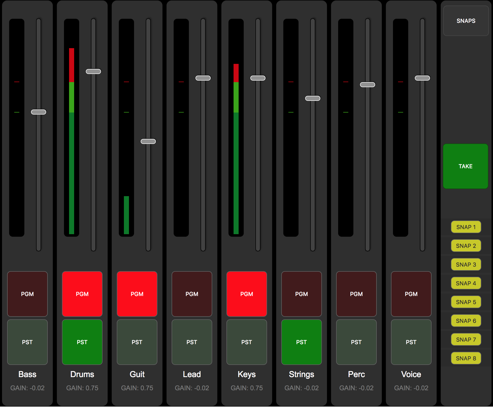
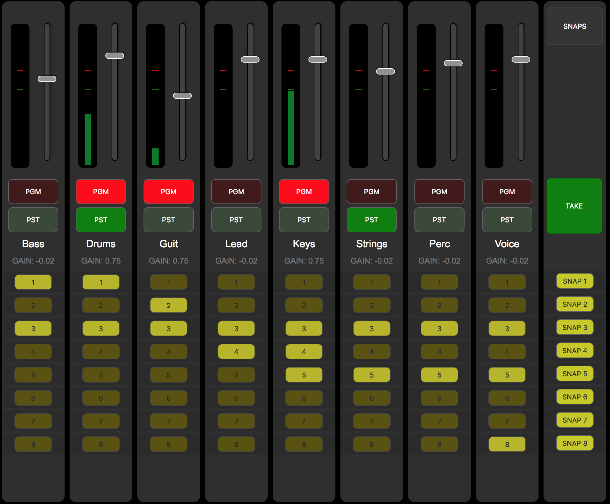

# Sisyfos Audio Controller

## Audiomixer control build with the logic from a videomixer.

You use the fader for the level, and PGM on/off for fade-in/out.
TAKE crossfades between PGM & PST:



### Snaps takes preset into PST:





### Install:
```
git clone https://github.com/olzzon/producers-audio-mixer.git
cd producers-audio-mixer
yarn
yarn start
```

## Settings:
(Mixer presets are stored in MixerProtocolPresets.js)
### Following preset name are possible:
* CasparCG
  * copy sisyfos-casparcg-geometry.json from Docs/CasparCG-Example to the root of your user account
  * base your casparcg.config by the casparcg.config file in the same folder
  * remember to active OSC in the casparcg.config file

* reaper
  * OSC protocol for control Reaper (reaper.fm)
* Ardour Master
  * OSC protocol for Ardour (www.ardour.org)
  * Port 3819
  * The volume change in Ardour is on it´s channel faders.
  * Todo:
    * Group support
    * Meter calibration
* Midas Master
  * OSC protocol for Midas M32 and Behringer X32
  * Port 10023
  * The volume change on the Midas/X32 desk is on it´s channel faders.
* Midas Client
  * OSC protocol for Midas M32 and Behringer X32
  * Port 10023
  * Route ch 1-16 to bus 1-2 and in main turn off main stereo
  * Set send to Bus 1-2 to Post Fader on all channels
  * Link Bus 1-2 to stereo and in main turn on main stereo
  * Send to Bus 1-2 is then used for Fade In-Out
  * Be aware of post faders mix% issues.
* Behringer xr client
  * OSC protocol for Behringer XR12-16-18
  * Port 10024
  * Route ch 1-16 to bus 1-2 and in main turn off main stereo
  * Set send to Bus 1-2 to Post Fader on all channels
  * Link Bus 1-2 to stereo and in main turn on main stereo
  * Send to Bus 1-2 is then used for Fade In-Out
* Behringer xr master
  * OSC protocol for Behringer XR12,16,18
  * Port 10024
  * In this version the Behringer is slave of Producers-Audio-mixer, so faders on the behringer is turned down when channel is of.
* midi
  * Generic MIDI - still preminilary


## Automation Support:
It´s possible to control the Producers-Audio-Mixer from an automationsystem, for it to act as middleware.

## Set state:
To set the state send these OSC commands from you Automation to ProducersAudioMixer Port: 5255:
#### Set channel to PGM (optional: indiviaul fadetime): 
(if second is missing it will take default fade value)
/ch/1/mix/pgm - integer: { 0 or 1 } - float { fadetime in ms }
#### Set channel to PST:
/ch/1/mix/pst - integer: { 0 or 1 }
#### Set channel faderlevel:
/ch/1/mix/faderlevel - float {between 0 and 1}
#### Set group to PGM:
/grp/1/pgm - integer: { 0 or 1 }
#### Set group to PST:
/grp/1/pst - integer: { 0 or 1 }
#### Set group faderlevel:
/grp/1/faderlevel - float {between 0 and 1}
#### Crossfade between PGM and PST:
/take
#### Set snap 1-xx to PST:
/snap/1
#### Fade all channels to black (mute)
/fadetoblack
#### Hide or show channel strips on GUI: 
/ch/{value1}/visible - integer { 0 or 1 }
#### Hide or show group strips on GUI: 
/grp/{value1}/visible - integer { 0 or 1 }

## Get state:
#### Get state channel PGM:
/state/ch/1/mix/pgm - returns pgm state integer { 0 or 1 }
#### get state channel PST:
/state/ch/1/mix/pst - returns pgm state integer { 0 or 1 }
#### Get state channel faderlevel:
/state/ch/1/mix/faderlevel - float {between 0 and 1}
#### Get state group PGM:
/state/ch/1/mix/pgm - returns pgm state integer { 0 or 1 }
#### get state group PST:
/state/ch/1/mix/pst - returns pgm state integer { 0 or 1 }
#### Get state group faderlevel:
/state/ch/1/mix/faderlevel - float {between 0 and 1}
